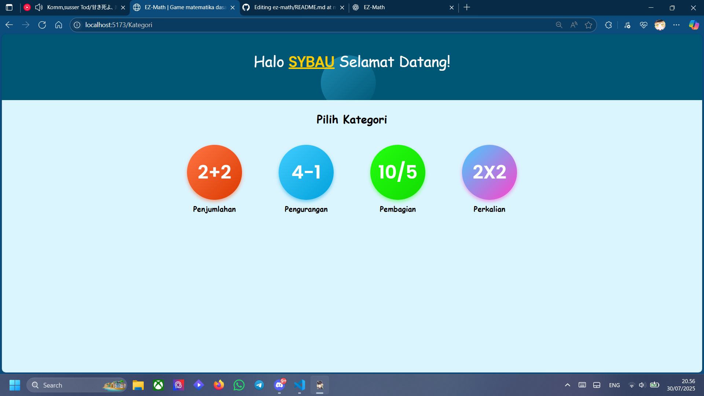

# 🎮 EZ-Math Game Quiz Matematika Dasar Berbasis Web 

Game quiz matematika dasar berbasis web yang menyenangkan dan agak laen.

---

## ✨ Fitur

- ✅ Random GIFs meme nguwawor
- 🎉 Efek Confetti
- 🔊 Efek Suara
- 💻 Design Responsive (mungkin)
- ⚡️ Perfroma cepat dengan framework vite

---

## 📦 Dependencies yang dipake

- **React** – Component-based UI
- **Vite** – Fast development server and build tool
- **Tenor API** – To fetch random memes
- **CSS / Tailwind (Optional)** – For styling
- **HTML5 Audio API** – For sound effects
- **React Confetti Explosion** – Confetti animation

---

## 🚀 Menjalankan Projek

### 1. npm install
### 2. npm run dev
### 3. buka http://localhost:5173/ di browser
